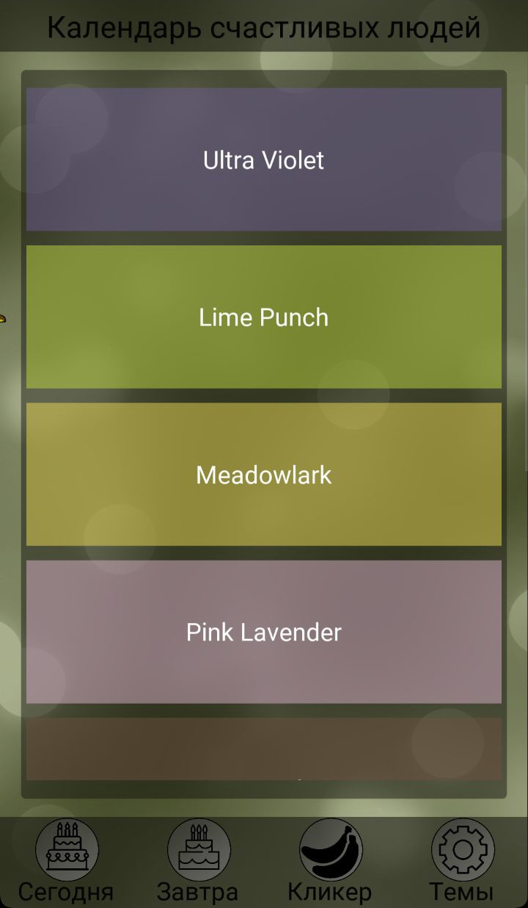

# What today's holiday?

## This app shows today's holiday.


## How to build:

### Arch Linux install:

Auto Install Kivy:

`./scriptKivyProjectInstall.sh `

### Building:
```
buildozer android debug
  
Apk file -> ./bin/*.apk
Start app -> python main.py
```

## Screenshot:

 

## Project Structure:


# Created by Alexander Komyakov
For any kind of help, support, suggetion and request ask in me
## Follow on:
<p align="left">
<a href="https://github.com/Alexander-Komyakov"></a>
</p><p align="left">
<a href="https://vk.com/shurikkomyakov"></a>
</p><p align="left">

